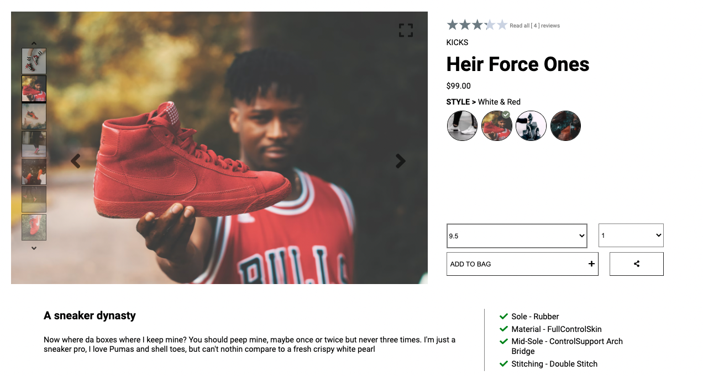
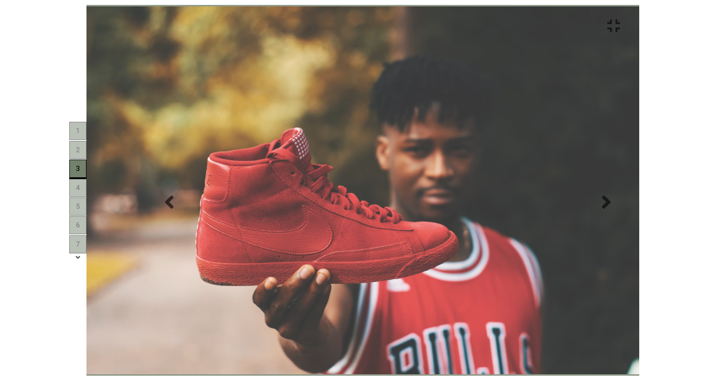
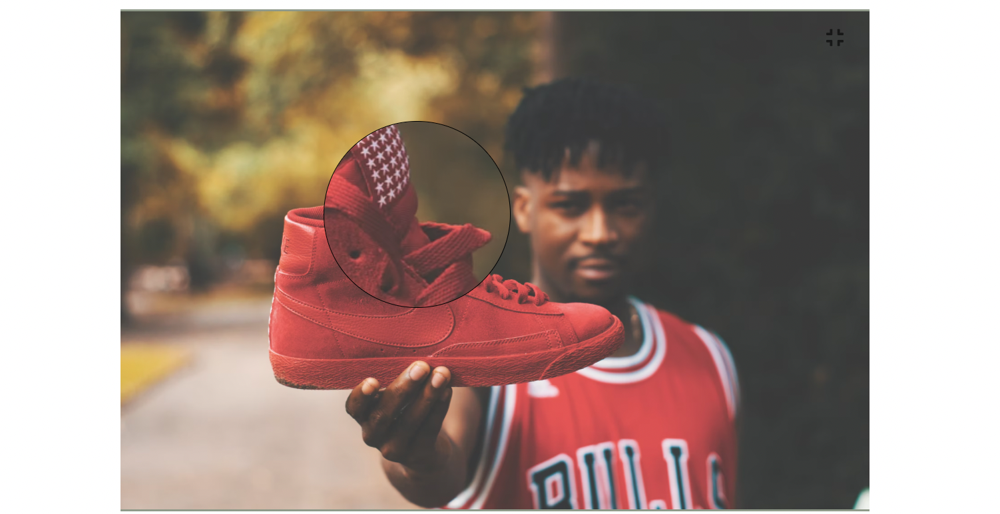
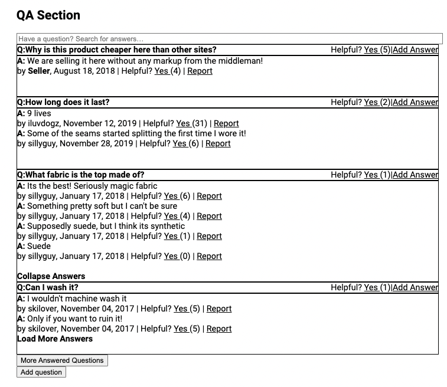
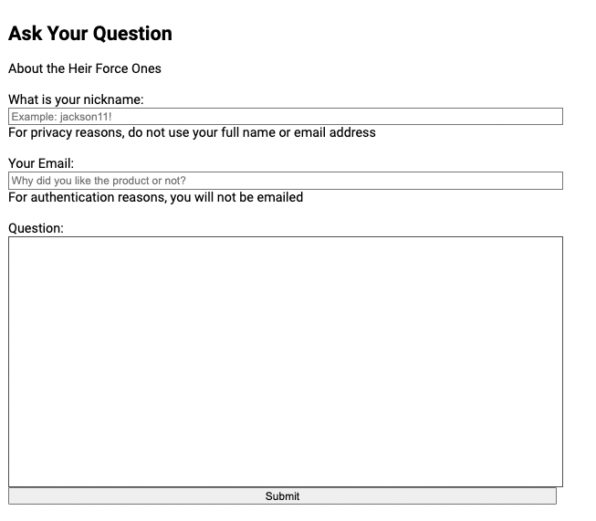
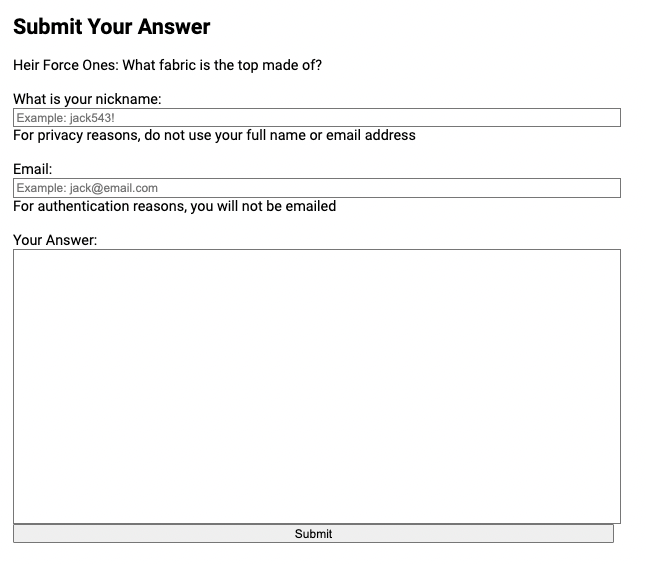
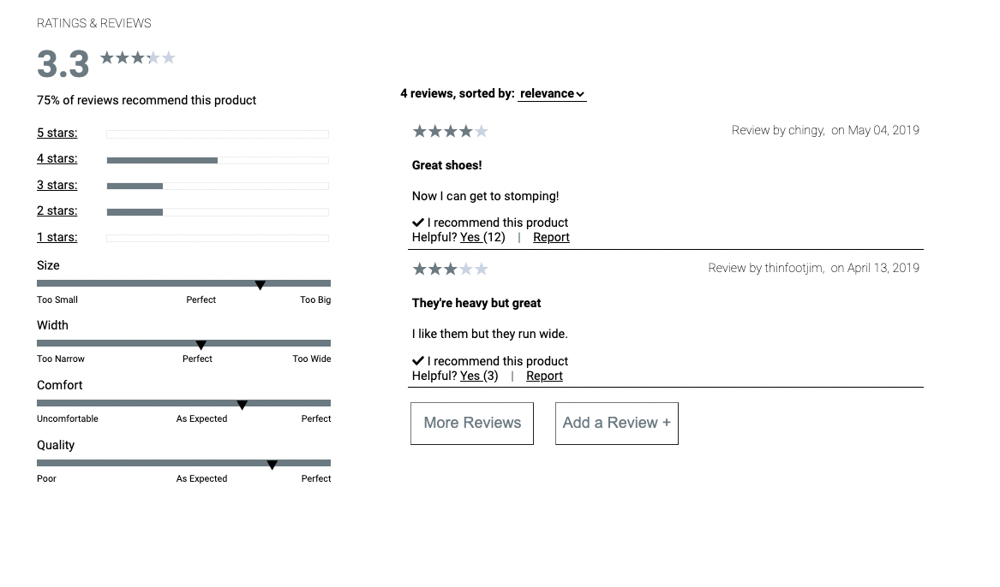
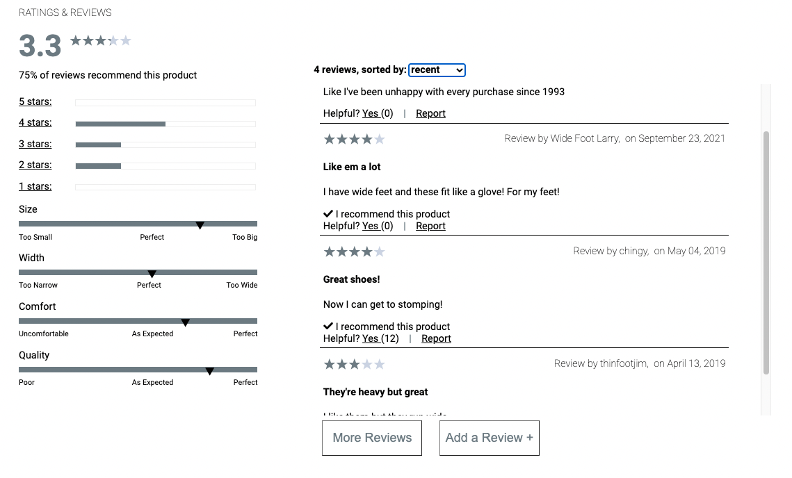
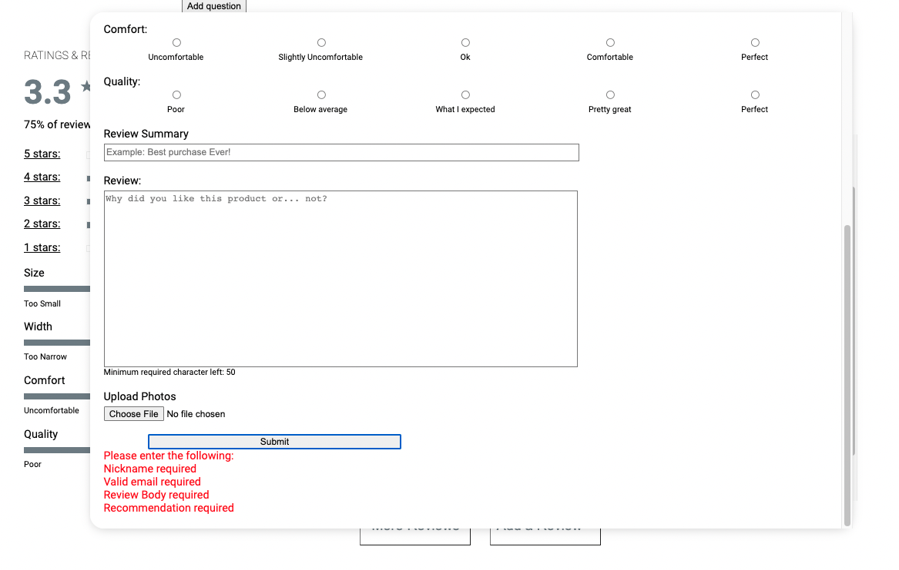

# Project Catwalk
           

## About

Front end web development capstone project. Hackreactor 2021. Project Catwalk comprises a complete redesign of a ficticious retail portal in order to modernize the website. The focus of this project is to implement a minimum viable product for the retail application.

## Setup
- Clone this repo
- Checkout 'deployed' branch for most recent version
- Run `npm install` to install all the dependencies.
- Create a config/config.js file with any valid github token

## Usage
After you clone this repo to your desktop, go to its root directory and run `npm install` to install its dependencies.

Once the dependencies are installed, you can run  `npm run bundle` to start the application. This will compile all the jsx to your local machine under 'client/dist/bundle.js' and start an express server on port 3000 through nodemon. You will then be able to access it at localhost:3000

## Demo by Feature

### Product Overview
Author: Keanu Hasty

Shows landing page, image carousel, available styles, and add button that conditionally render size dropdown is none is selected.

On click, will display large format of selected image with reduce size button as well as image carousel to move between images.

When clicking on the image, displays magnifying glass zoom on large format image.

### Questions and Answers
Author: Richard Cuffee

Initial view of QA section with answers expanded for one of the questions. Report button hides reported entries, and helpful button only allows one click per user per entry.

Modal Add Review form with validation for required fields and valid email.

Modal Add Answer form with validation for required fields and valid email. Allows answers to be added to specific product.

### Ratings and Reviews
Author: JJ Marquis

Shows inital view of reviews section. Characteristics and review average are product specific and render according to data from reviews. Stars and rating bars fill in proportion to relevant review data

User can sort by relevance, helpfulness, and recency, as well as expand review field to show more reviews. If users click a star rating, only reviews at the rating will display.

Users can add reviews to a specific product with only relevant characterstics availble for rating. Form has validation for required fields, and valid email. New reviews display in real time.

## Authors

Keanu Hasty

Richard Cuffee

JJ Marquis

